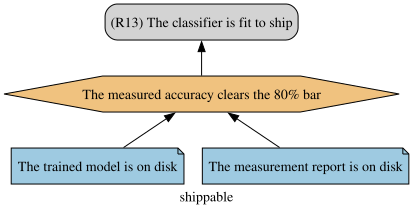

# Chapter 4: Executing a model

By the end of this chapter, you can:

- compile a `.jd` model into the two files the jPipe runner needs, and run them;
- write the execution layer: evidence leaves that report a fact and hand it on, and a strategy that
  judges what they handed it;
- read the two shapes a failing run takes, and have a server re-check the argument without you.

Everything you wrote in part 1 was drawn, not run: a drawn argument claims that a model is fit to
ship on a machine where no model exists, because nothing ever went and looked.

The model is given to you complete in [shippable.jd](shippable.jd):

<p align="center">
  
</p>

Your work is the layer underneath it, a Python function per element, each answering its element's
question about the world. What each element is asked for differs:

```
claim      (R13) The classifier is fit to ship   <- concluded, never executed
bar        The measured accuracy clears 80%      <- the only judgement in the argument
model      The trained model is on disk          <- a fact
metrics    The measurement report is on disk     <- a fact
```

## What is mocked, and why

A real classifier would drag a whole toolchain behind it, and this chapter is not about classifiers,
so the artifacts are stand-ins, in [mocks/](mocks/):

- [mocks/model.txt](mocks/model.txt), a text file where a trained model would be;
- [mocks/measurements.json](mocks/measurements.json), the numbers a real evaluation run would emit.

The numbers are **model C's column from the dashboard** in chapter 3, so the accuracy your argument
is about to check is one you have already looked at. A binding that reads a mock and a binding that
reads the real thing differ only in what is behind the file name.

This chapter adds **no dependency**. `json` and `pathlib` from the standard library are all you need,
and the runner is pinned in `Pipfile.lock`.

## Setting up

Once, if you have not already:

```sh
tutorial-re-2026 $ pipenv sync --dev
```

Every command in this chapter is run from the repository root, and every path is written from there,
so nothing depends on which directory you are standing in.

## 4.1: Export the model, and generate the skeleton

The runner takes two inputs and gives back one report:


The runner does not read `.jd`. It reads the compiled form, and it needs a Python file binding
functions to elements. The editor writes both, from the model your cursor is in.

Open [shippable.jd](shippable.jd) and put the cursor inside `shippable`. Then export it twice, each
time by right-clicking and choosing **jPipe**, then the format, or from the download icon in the
preview toolbar, or by name in the command palette:

- *Download as JSON*, saved as `shippable.json`. This is the compiled argument the runner reads. The
  repository already ships that file, because the CI job in 4.5 runs it without a compiler; exporting
  it yourself writes the same bytes over the top, so `git status` stays quiet.
- *Download as Python*, saved as `skeleton.py`. This is the binding layer, one empty function per
  element.

The save dialog opens at the repository root and offers the model's own name, so change the folder to
`part_2/chapter_4/`, and the second file's name to `skeleton.py`.

Those two files are the two cards on the left of the figure. The report on the right has a failing
check in it, which is what 4.4 is about.

Open `skeleton.py`. There is one function per element the runner executes, each tied to its element
by `@jpipe_link("shippable:<id>")`, and every body is `pass`. There is no function for `claim`: the
compiler generates none for a conclusion, which is the first thing this chapter tells you about
conclusions. That skeleton is the starting point of
[exercises/bindings.py](exercises/bindings.py), which is the same file with the work marked out and a
`MOCKS` path added so you do not spend the chapter on relative paths. Work in that one.

Now run it:

```sh
tutorial-re-2026 $ pipenv run jpipe-runner \
    -l part_2/chapter_4/exercises/bindings.py part_2/chapter_4/shippable.json
```

It refuses, and it says why:

```
[EvidenceDependencyValidator]
Pipeline validation error: evidence node does not produce any variables.
  • Element: shippable:model ("The trained model is on disk") [evidence]
  • Problem: This evidence node produces no output variables.
  • Impact: Connected strategies will receive no inputs from this evidence.
  • Fix: Ensure the function bound to shippable:model calls produce(...) at least once.
```

The same block follows for `shippable:metrics`.

**Let the tool lead for the rest of this chapter.** The runner checks the wiring before it runs
anything, and each complaint names the next thing to do. There are two of those, in order: leaves
that produce nothing, then leaves whose output nobody consumes. Once the wiring holds, the run
itself starts, and a function that returns nothing counts as a failed check. Fix the complaint in
front of you and run again.

**Done when:** you have exported both files, and you have read the error above rather than skipped
past it.

## 4.2: Make the facts real

**Elements:** `shippable:model`, `shippable:metrics`

An evidence leaf reports whether an artifact is there, and hands it onward. It renders no judgement:
"the file exists" is a fact, and facts are what the argument is built out of.

Each leaf needs three things:

1. `@jpipe(produce=["trained_model"])`, declaring the name it offers to the rest of the argument;
2. a call to `produce("trained_model", <value>)` with what it found;
3. `return True` when the artifact is there, **`return False` when it is not**.

The name it produces is not the element's id. `shippable:model` is a place in the argument;
`trained_model` is the value that travels from there to whoever asks for it, and the report is
produced as `measurements` by `shippable:metrics`. Naming both the same string reads as one thing and
is two, so keep them apart.

Returning `False` is not an error, it is a verdict, and it is one this argument is allowed to reach.
Raising an exception instead throws away the runner's ability to tell you which part of the argument
stopped holding.

<details>
<summary>❓If you need help with Python API</summary>

A path is a `Path`, joined with `/`, and `MOCKS` is already defined at the bottom of the file:

```python
artifact = MOCKS / "model.txt"   # mocks/model.txt, whatever directory you launched from
artifact.is_file()               # True when it is there and is a file
artifact.read_text()             # the whole file, as a str
```

A report is text until it is parsed, and `json` turns it into a dict. The stub imports `pathlib`
but not `json`, so add the import yourself:

```python
measurements = json.loads(report.read_text())
measurements["accuracy"]             # 0.818, and a KeyError if the key is absent
measurements.get("accuracy", 0.0)    # 0.0 instead of the error
```

`json.loads` raises `json.JSONDecodeError` when what it read is not JSON. Catching it is how you
decide what a corrupt report means for your leaf:

```python
try:
    measurements = json.loads(report.read_text())
except json.JSONDecodeError:
    ...
```

`produce` is the parameter the runner hands you, so calling it takes no import:

```python
produce("trained_model", artifact.read_text())
```

</details>

<br/>

**Done when:** the `EvidenceDependencyValidator` error changes. It does not disappear, it becomes a
different complaint, because the leaves now produce something that nothing consumes yet. That is 4.3.

## 4.3: Make the check real

**Element:** `shippable:bar`

The strategy is the one place in this file where a judgement belongs, and so the only place a
threshold may appear. It declares what it needs, takes those values as parameters, and returns
whether the bar is cleared:

```python
@jpipe(consume=["trained_model", "measurements"])
def the_measured_accuracy_clears_the_80_bar(trained_model, measurements) -> bool:
```

`produce` is gone from both the decorator and the signature, because this function produces nothing.
Every name in `consume=[]` must also be used in the body: the decorator checks, and says so if you
declare a dependency you do not use.

<details>
<summary>❓If you need help with Python API</summary>

The values arrive as ordinary parameters, holding whatever the leaves produced: a `str` for
`trained_model`, and the dict `json.loads` returned for `measurements`.

```python
measurements.get("accuracy", 0.0) >= ACCURACY_BAR   # a bool, which is what you return
bool(trained_model.strip())                         # False when the file was empty or blank
```

The bar itself is a module-level constant, written once, near the top or bottom of the file:

```python
ACCURACY_BAR = 0.80
```

`and` returns a bool here, so a single expression can carry both parts of the check.

</details>

<br />

**Done when:** the run is green, four passed and nothing failed.

```
evidence<shippable:model>   :: The trained model is on disk           | PASS |
evidence<shippable:metrics> :: The measurement report is on disk      | PASS |
strategy<shippable:bar>     :: The measured accuracy clears the 80%.. | PASS |
conclusion<shippable:claim> :: (R13) The classifier is fit to ship    | PASS |
```

The conclusion passes although there is no function for it anywhere in the file. A conclusion holds
when everything under it holds, so there is nothing for the runner to call.

## 4.4: Break it, twice

A green run does not tell you the argument can fail. Make it fail, in two ways, and compare what the
report does.

**Lower the measurement past the bar.** Edit `accuracy` in
[mocks/measurements.json](mocks/measurements.json) to `0.72` and run again:

```
strategy<shippable:bar>     :: ...clears the 80% bar          | FAIL |
conclusion<shippable:claim> :: (R13) The classifier is fit... | SKIP |
```

The facts still hold: the model is there, the report is there. What failed is the judgement, and the
conclusion is no longer claimed.

**Now take an artifact away.** Restore `0.818`, rename `mocks/model.txt`, and run again:

```
evidence<shippable:model>   :: The trained model is on disk   | FAIL |
strategy<shippable:bar>     :: ...clears the 80% bar          | SKIP |
conclusion<shippable:claim> :: (R13) The classifier is fit... | SKIP |
```

A different shape. The check was never attempted, because a node whose support has failed is skipped
rather than run, so no judgement is made about a thing that is not there.

Put `model.txt` back when you are done.

**Done when:** you can say which of the two failures you would rather find in your CI log, and why.

## 4.5: Hand it to a server (live demo)

Unlike the exercises before it, this part is a live demo. Running a job of your own means creating a
GitHub repository and configuring it, and that is an hour you do not have to spend here, so this one
runs on the screen and you watch it.

The job this repository ships is in
[.github/workflows/justification.yml](../../.github/workflows/justification.yml). Trimmed to its
shape:

```yaml
name: Justification (chapter 4)

jobs:
  shippable:
    runs-on: ubuntu-24.04
    env:
      SHIPPABLE_BAR: ${{ inputs.bar || '0.80' }}
      SHIPPABLE_MODEL: ${{ inputs.model || 'model.txt' }}
      SHIPPABLE_METRICS: ${{ inputs.metrics || 'measurements.json' }}
    steps:
      - uses: actions/checkout@v4

      - name: Check the argument, and draw the verdict
        uses: jpipe-mcscert/jpipe-runner@v3.5.3
        with:
          version: v3.5.3
          jd_file: part_2/chapter_4/shippable.json
          library: part_2/chapter_4/solutions/bindings.py
          embed_image: "true"
          image_branch: "diagram-images"
          github-token: ${{ secrets.GITHUB_TOKEN }}
```

Two lines do the work:

- **`jd_file`** is the compiled argument, `shippable.json`, checked into the repository so that the
  job needs no compiler.
- **`library`** is the Python beside it, the finished bindings from `solutions/`, not the skeleton
  you have been filling in.

Everything else belongs to the action: it installs the pinned runner, runs it, draws the diagram with
each element's verdict on it, and posts that diagram wherever the run was triggered from.

The demo has two halves.

**From the Actions tab.** **Justification (chapter 4)**, **Run workflow**, inputs left alone: the run
is green and the report is the four lines of 4.3. Then the same button with `bar` raised to `0.90`:
the strategy fails, the conclusion is skipped, and the job goes red. Same argument, same artifacts,
one number moved.

**From a pull request.** A commit lowers the measured accuracy in `mocks/measurements.json` and is
pushed on a branch. The check runs on the pull request without anyone asking it to, and the action
comments the diagram underneath, red where the argument stopped holding. A second commit puts the
number back, and the next comment is green.

<details>
<summary>Doing that second half yourself, on a copy you own</summary>

You need push rights, so start from a copy of the repository rather than this one:

```sh
$ gh repo fork jpipe-mcscert/tutorial-re-2026 --clone
$ cd tutorial-re-2026
tutorial-re-2026 $ git switch -c demo/lower-the-accuracy
```

Edit `part_2/chapter_4/mocks/measurements.json`, `accuracy` from `0.818` to `0.72`, then:

```sh
tutorial-re-2026 $ git commit -am "Demonstration: the accuracy drops below the bar"
tutorial-re-2026 $ git push -u origin demo/lower-the-accuracy
tutorial-re-2026 $ gh pr create --fill --repo <your-account>/tutorial-re-2026
```

The `--repo` matters: without it, `gh` offers to open the pull request against this repository, where
your job would not be the one running. Then watch it, and read what the action left:

```sh
tutorial-re-2026 $ gh pr checks --watch
tutorial-re-2026 $ gh pr view --comments
```

GitHub asks you to enable Actions the first time you open that tab on a copy of somebody else's
repository.

</details>

<br />

**Done when:** you have watched a check go from green to red, and read the report in a CI log rather
than in your terminal.

## Where this goes

The argument is attached to the world now, and something other than you re-checks it. What has not
changed is that you wrote it whole, by yourself, in one file. Chapter 5 is where that stops:
arguments owned by different people and gathered without rewriting, and leaves that turn out to need
an argument of their own.

Worked answers are in [solutions/bindings.py](solutions/bindings.py). Read them after you have tried.
