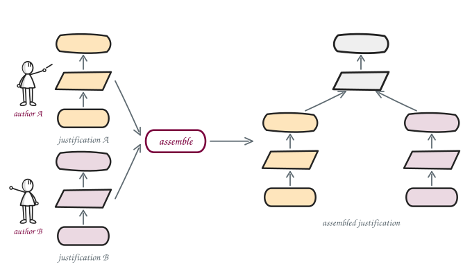
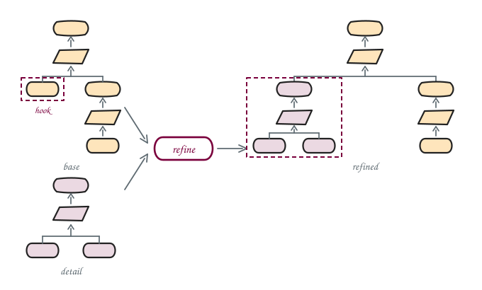

# Chapter 5: Assemble and refine

By the end of this chapter, you can:

- gather independent justifications under one claim with `assemble`, without editing any of them;
- replace an asserted leaf with a whole argument using `refine`, leaving the rest of the model alone;
- read a model summary to see which nodes merged, and say why a shared label is what made them meet.

Every model so far has been written whole, by one person, in one file. Assurance cases are not built
that way for long: different people own different claims, and an argument that looked finished last
month turns out to rest on a leaf nobody ever justified. jPipe has one operator for each situation.

- **assemble** adds breadth. Several independent justifications, none aware of the others, are
  gathered under one new strategy and one new conclusion. Nothing is rewritten.
- **refine** adds depth. One element of an argument, asserted until now, is replaced by a whole
  justification. Only that branch changes.

Reference pages: [assemble](https://www.jpipe.org/tutorials/assemble/) and
[refine](https://www.jpipe.org/tutorials/refine/).

## How to work

Nothing is executed here. Chapter 4 covered running a model; this chapter is about structure, so what
you work from is the compiler's model summary: one line per model, counting what each is made of.

Open the stub and its preview, from the preview icon in the editor title bar or by right-clicking and
choosing **jPipe**, then *Open Diagram Preview*. The notepad icon at the top right of the panel
switches to the diagnostic view, where **Models** lists every model in the file with its element
count, and *Problems* lists what the compiler refuses. Selecting **Text** in the top right of that
view shows the compiler's own report, summary included, which is the same thing the terminal prints:

```sh
tutorial-re-2026 $ jpipe diagnostic -i part_2/chapter_5/exercises/01_assemble.jd
```

Worked answers are in [solutions/](solutions/). Read them after you have tried, not before.

## The bricks

The three quality lenses of the emotion detection case study, one file each in [bricks/](bricks/),
each small enough to read in a glance:

| Brick | Claims | Rests on |
|---|---|---|
| [fair](bricks/fair.jd) | (R1) The classifier shall be fair | the flip-rate is below 10% |
| [performant](bricks/performant.jd) | (R2) The classifier shall be performant | the accuracy clears the 80% bar |
| [graceful](bricks/graceful.jd) | (R3) The classifier shall fail gracefully | the severe-error rate is below 5% |

Those are three columns of the dashboard you looked at in chapter 3. A fourth file,
[trustworthy](bricks/trustworthy.jd), is the detail argument 5.2 needs.

**Read the evidence labels before you start.** A label is the contract between bricks: jPipe unifies
nodes that say the same thing, and it unifies on the **label**, not the id. All three bricks cite
"The trained model is available", worded identically, so those three become one node. The test
dataset is the interesting case: `performant` cites the requirement, "(R4) The test dataset shall be
trustworthy", which is exactly what [trustworthy](bricks/trustworthy.jd) concludes, while `graceful`
asserts the plain fact, "The test dataset is trustworthy". Two bricks that word the same artifact
differently do not meet, however carefully they were named.

## 5.1: Assemble

**File:** [exercises/01_assemble.jd](exercises/01_assemble.jd) · **Crib from:**
[chapter_2/assemble.jd](../../part_1/chapter_2/assemble.jd)

<p align="center">
  
</p>

Each brick keeps its shape, its conclusion becomes a sub-conclusion, and the new strategy and
conclusion are the only things added. `assemble` does not invent those two labels for you: what the
lenses together let you claim is a judgement, and writing it down is the work.

The stub loads two of the three bricks. You build the assembly twice, once with those two and once
with the third added, so that the second summary can be compared against the first.

### Step 1: two bricks

`fair` and `performant` are loaded already, one `load` line each. Write the assembly under them:

```
justification deployable is assemble(fair, performant) {
    conclusionLabel: "..."
    strategyLabel:   "..."
}
```

Type as little of that as you can, because the editor knows all of it:

- after `justification deployable is `, `⌃Space` / `Ctrl+Space` offers the operators, `assemble` and
  `refine`, each with a one-line summary, and accepting one writes the call and its braces;
- inside the parentheses, it offers the models in scope, which is the two bricks, and stops offering
  one once you have listed it;
- inside the braces, it offers the keys `assemble` takes: `conclusionLabel` and `strategyLabel`, both
  required, and `unifyBy` and `unifyExclude`, which control merging and which nothing in this chapter
  needs to set.

Leave a required key out and the editor says so, with a fix that writes it back.

**Done when:** the diagnostic is clean and `deployable` appears in the summary as:

```
conclusion(1), sub-conclusion(2), strategy(3), evidence(3)
```

Two bricks brought four pieces of evidence and three came out. One label is shared, and that is the
whole of the merge: both bricks cite "The trained model is available", so there is one such node in
the result rather than two.

### Step 2: the third brick

Now add `graceful`. It needs a `load` of its own, and you can pick the path rather than type it: type
`load "` and press `⌃Space` / `Ctrl+Space`, and the editor lists the `.jd` files it can reach from
this one. Then add `graceful` to the call.

**Done when:** the diagnostic is clean and `deployable` has become:

```
conclusion(1), sub-conclusion(3), strategy(4), evidence(4)
```

Six pieces of evidence were declared across the three bricks, and four came out. Which two merged,
and why did the two about the test dataset stay apart when they are plainly about the same file?

## 5.2: Refine

**File:** [exercises/02_refine.jd](exercises/02_refine.jd)

<p align="center">
  
</p>

`graceful` claims the test dataset is trustworthy and stops there. A leaf is an assertion: it asks to
be taken as given. [trustworthy.jd](bricks/trustworthy.jd) is somebody arguing it instead, that the
splits are disjoint and every label is one of the eight Plutchik emotions.

The stub loads `graceful` alone, so this exercise is in two steps as well.

### Step 1: load the argument you are grafting in

`trustworthy` needs a `load` beside the one already there, and the path completes as it did in 5.1:
type `load "` and press `⌃Space` / `Ctrl+Space`.

Run the diagnostic before writing anything else. The summary lists two models that know nothing about
each other: `graceful`, whose leaf asserts that the test dataset is trustworthy, and `trustworthy`,
which concludes the requirement (R4) that it shall be. The two are worded differently on purpose, and
5.3 turns on what happens to that wording here.

### Step 2: refine

```
justification graceful_deep is refine(graceful, trustworthy) {
    hook: "..."
}
```

The editor writes most of this too, and one completion here is worth slowing down for:

- `refine` takes exactly two models, and the order carries the meaning: the base first, the argument
  being grafted in second;
- inside the quotes after `hook:`, `⌃Space` / `Ctrl+Space` lists **the evidence leaves of the base**,
  each with its label beside it and `evidence in graceful` as its detail. Only leaves are offered,
  because a leaf is the only thing a refinement can replace. Pick the one about the test dataset.

**Done when:** the diagnostic is clean, and comparing `graceful` with `graceful_deep` shows one node
that changed kind:

```
graceful        conclusion(1),                    strategy(1), evidence(2)
graceful_deep   conclusion(1), sub-conclusion(1), strategy(2), evidence(3)
```

The leaf became a sub-conclusion, and the argument that now supports it brought a strategy and two
pieces of evidence of its own. Nothing in `graceful.jd` changed.

Look at what that node says now. It asserted "The test dataset is trustworthy" and it reads "(R4) The
test dataset shall be trustworthy", because the label came in with the argument that replaced it.
That is the substitution the compiler makes without asking, and it is what 5.3 builds on.

## 5.3: Compose them

**File:** [exercises/03_composed.jd](exercises/03_composed.jd)

Refine first, then assemble: the deepened brick goes into the assembly in place of the shallow one,
and `fair` and `performant` join it untouched.

Nothing is retyped here, and the loads are given. `graceful_deep` was built in 5.2, so the stub loads
that file rather than writing the refinement out a second time:

```
load "02_refine.jd"
load "../bricks/fair.jd"
load "../bricks/performant.jd"
```

A `load` brings the models a file defines and the models it loaded in turn, so `graceful` and
`trustworthy` arrive with it. Run the diagnostic and you should see five models, `graceful_deep`
among them:

```
graceful_deep   conclusion(1), sub-conclusion(1), strategy(2), evidence(3)
```

If it is missing, 5.2 is not finished, and the assembly below will refuse with
`[unresolved-symbol]` rather than build something half true.

### Step 1: assemble, with the deep brick

Now the assembly, `graceful_deep` in place of `graceful`, and the other two as they are:

```
justification deployable is assemble(graceful_deep, fair, performant) {
    conclusionLabel: "..."
    strategyLabel:   "..."
}
```

Inside the parentheses the completion offers `graceful_deep` alongside the bricks. Nothing
distinguishes it at the point of use: it arrived through a `load`, exactly as they did, and it does
not matter that it was built by an operator rather than written by hand.

**The order you list them in does not matter.** `assemble(graceful_deep, fair, performant)` and
`assemble(performant, fair, graceful_deep)` give you the same model, down to the ids, the kinds and
the relations. Swap two of them and run the diagnostic again rather than taking that on trust, since
this is the one place where two bricks disagree about what they are saying: `graceful_deep` argues
that the dataset is trustworthy, `performant` asserts it. Where a shared label brings those two
together, the merge keeps the kind that can carry an argument, so the node is a sub-conclusion either
way.

**Done when:** the diagnostic is clean and `deployable` appears as:

```
conclusion(1), sub-conclusion(4), strategy(5), evidence(4)
```

### Step 2: read what happened, which is not code

Compare this `deployable` with the one you built in 5.1. There, the assembly carried two separate
leaves about the same file, one per wording:

```
evidence        (R4) The test dataset shall be trustworthy
evidence        The test dataset is trustworthy
```

Here it carries one node instead:

```
sub-conclusion  (R4) The test dataset shall be trustworthy
  strategy      The split is disjoint and every label is valid
    evidence    No test row appears in the training split
    evidence    Every label is one of the eight Plutchik emotions
```

`performant` cited that requirement and still does. Its file was never opened. It got an argued test
dataset because `trustworthy` concludes the requirement `performant` cites, and `refine` put that
conclusion where `graceful`'s bare assertion used to be.

Assemble lets people argue their own claims without negotiating, refine lets one of them go deeper
without disturbing the others, and the labels are what let the results meet.
